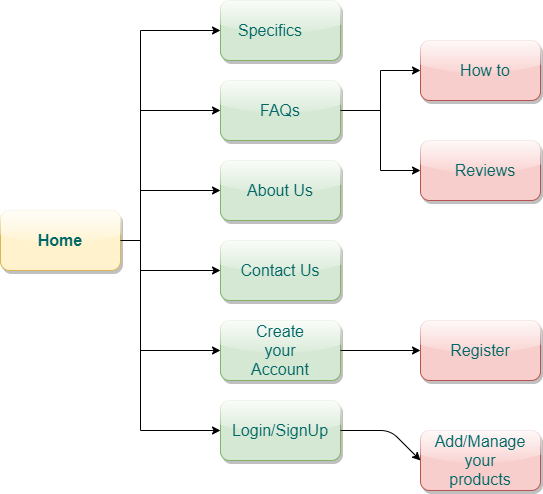
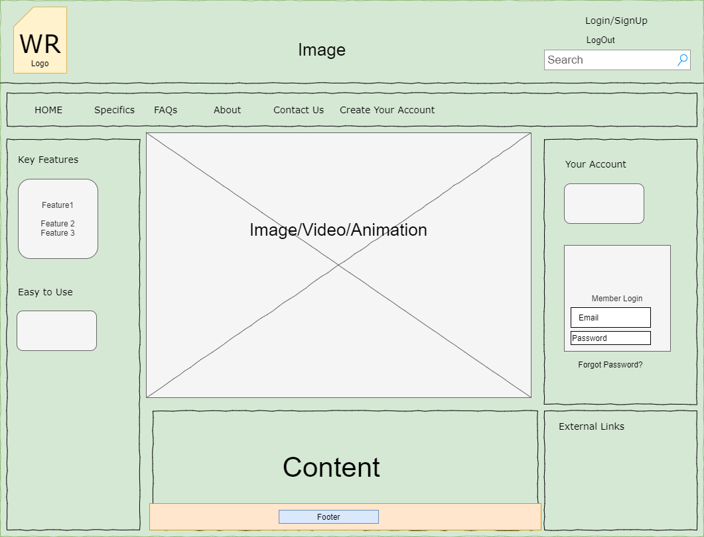
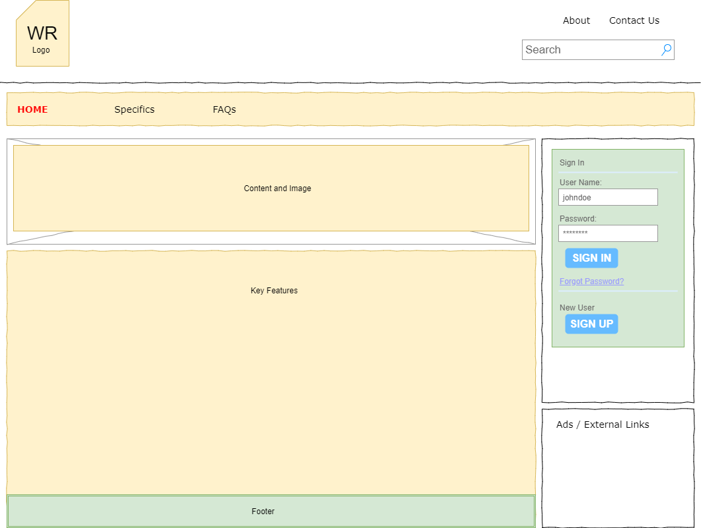
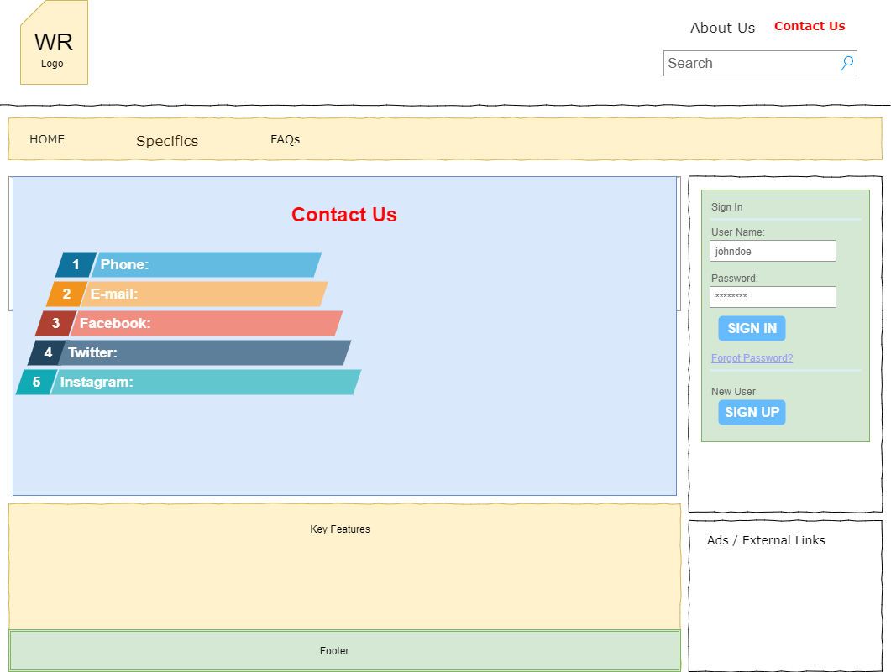
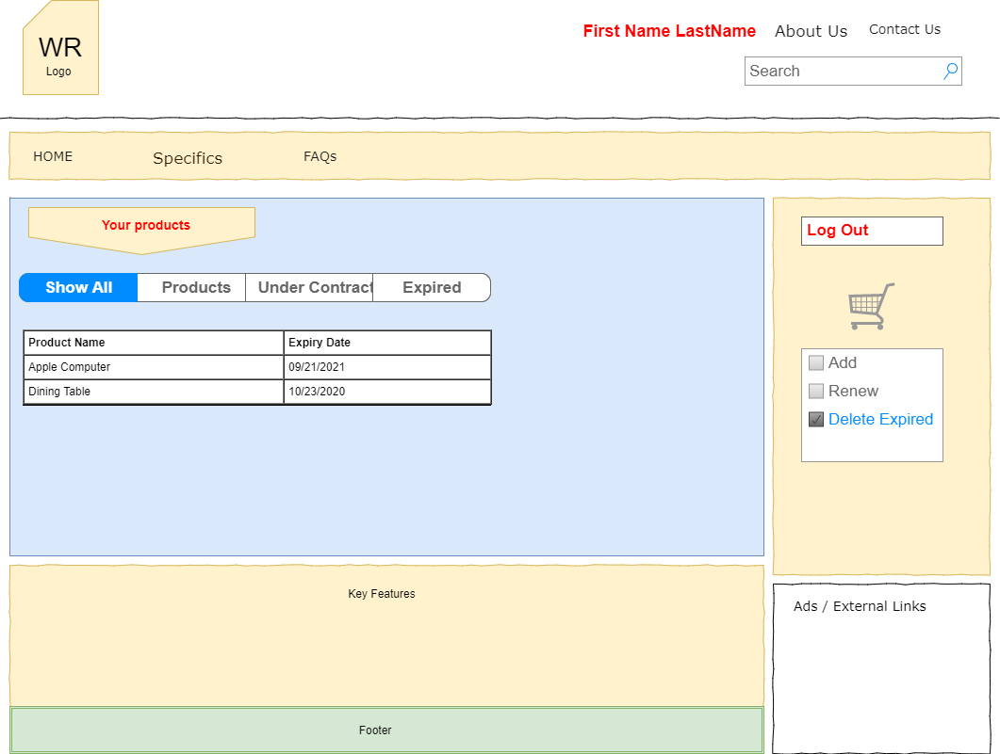

#**Sridevi15k Capstone project for Savvy Coders AUG 2020 cohort.**

# Savvy Coders Project Boilerplate Starter Kit

## Overview

This template repository contains several opinionated, 'starter' files and settings to help Savvy Coder students focus more time and energy on learning how to code and/or craft 'business logic' for projects and less time on configurations.

In addition to a '.gitignore' and some VS Code specific extensions and settings, it includes the 'recommended' settings for:

1. [ESLint](eslint.org)
2. [Stylelint](stylelint.io)
3. [Prettier](prettier.io)

## Get Started

**First and foremost,** make sure that your local machine is set up with all of the 'dev environment tooling' as per [this guide...](https://www.notion.so/codefinity/Setting-up-a-Local-Dev-Environment-97de62a546f943fbbc7a246b4785a343)

Well, after establishing your directory structure on your local machine, (e.g. '~/Code/SavvyCoders'), kindly [follow these girections](https://help.github.com/en/github/creating-cloning-and-archiving-repositories/creating-a-repository-from-a-template) - essentially, there should be a button 👆🏾that says **Use this template.**

Once this repo has been created on your GitHub, you can click on the button to 'clone' it as usual. Once it's `clone`d to your local machine, kindly `cd` into the directory and **be sure to do:** `npm i` to get all of the goodies. If you see any _errors_ (warnings are 🙆🏾‍♂️) on Windows, you may have to do `npm install`.

Now, enter `code .` to open this project in VS Code, and look for a prompt to 'install some extensions' once inside VS Code (in the bottom right of your screen). You should install these. 👍🏾

Update this README and make any other initial changes or 🌱 files, etc. Go ahead and do your usual `git` steps, etc. etc. etc.

**Note:** This is a template repository, no need to 'fork it.

**Create ... Week 1: Homework Documentation for capstone project**
----------------------------------------
>1. If you have not done so yet – create an account for yourself on [I'm a link to a web page!](www.github.com) (name should be professional). 
>2. Create your capstone repo (in a new folder) and add a **docs** folder. 
>3. Create a docs folder, add documentation in the form of markdown, images or PDFs. 
>4. Update your **README.md** file to link to your new project documentation. 
>5. **Your documentation should include..** 
  >>1. Definition of your audience (We already did this,correct?) 
  >>2. Definition statement (I want to create a web application that...) for your project 
  >>3. High level story (**elevator pitch**) 
  >>4. Outline of the content 
  >>5. User Flow 
  >>6. Wire frames (_1 wire frame per page minimum, hand-drawn is OK!_)

**Definition of your audience**
  >Usually most of us wouldn't track the warranty that comes with the products we buy. When it is time to replace the product for any defects in materials or workmanship or functioning, we don't remember if we have registered the product or we wouldn't be sure if there is still warranty time left. We need to put in a lot of money to get a new one when we don't register the product. So to solve this problem, I chose **warranty reminder app** for my capstone project. This website is meant for any individual who buy any kind of product that comes with a warranty from a manufacturer/retailer and willing to save money by putting in a little effort by registering the products they buy so they can be notified before the warranty expires and claim the warranty if necessary. That is getting everything we paid for.

**Definition Statement**
>I want to create a web application called Warranty reminder named **warrantyreminder.com** which is based on full stack web development.

**High Level Story**
>Hi! My name is **Sridevi Kalagara**. I have a background in Biochemistry, Customer Service and IT. I started my career as a Biochemistry instructor, then in IT and the recent one was in customer service. Due to some constraints regarding work authorization, I didn't get a chance to explore my interest for developing a code. My passion has been in analytical and critical problem solving which led me to learn coding concepts. Later I realized I need a mentor so I can go in the right direction to pursue the career of my interest. In this process I came across Savvy Coders over jobs.mo.gov website. The very same day I contacted them, they gave me a chance to attend the preview night and I am so happy that this program is for me.

>I am a person who would like to be well-planned and organized when it comes to any work I take up. For this reason I chose warranty reminder app named **warrantyreminder.com** for my capstone project, which is based on a full stack web development. This website is meant for any individual who buy any kind of product that comes with a warranty and willing to save money by putting in a little effort by registering the products they buy so they can be notified before the warranty expires. My project is a  full stack web development program based on Single Page Application and uses JavaScript, HTML 5, CSS 3, Node.JS/Express.JS, Git/GitHub, Heroku, Netlify, PostgreSQL. The website I am going to design is user friendly, simple and affordable compared to the similar websites I have researched. 

#**Outline of the Content** 
>1.**Make a list of pages** 
	>>1.Home/Landing 
	>>2.Specifics 
	>>3.FAQs 
	>>4.About Us 
	>>5.Contact Us 
	>>6.Create your Account 

>2.**Write a brief description of the content for each page** 
	>>1.Home/Landing page: Logo, picture, Navigation tab(Home, Specifics,    Support, About Us, Contact Us) Sign Up|Login, Key Features 
	>>2.Specifics: Overview, Warranties 
	>>3.FAQs: FAQs, How to, Reviews 
	>>4.About Us: Description on how we started the website. 
	>>5.Contact Us: Phone, Email, Facebook, Twitter 
	>>6.Create your Account: Welcome, Register, Already Registered? 

>3.**Navigation** 
 >>Once we are on the landing page, there will be options to move into any of the shown options to learn further or register as a new member as per customer requirement.

>4.**Main content** 
>>Content includes any of text/images/animation with only the relevant aspects that serve the purpose of the website. Login page will lead to add your products/review your products page where the member can see the details of the products.

>5.**Foot** 
>>Terms & Conditions, Privacy, E-mail

#**User Flow** Service application 

#**Wire frames**

